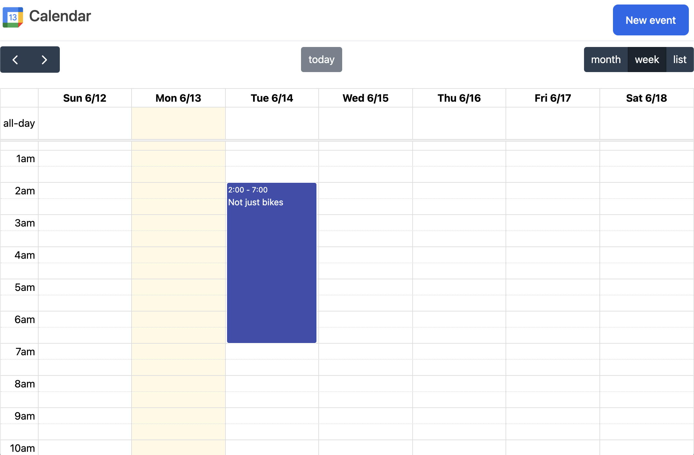

# Fullcalendar backend with Rails 8, Hotwire and Tailwind

A demonstration of what you can achieve with one scaffold, one small stimulus controller and two tiny [stimulus components](https://github.com/excid3/tailwindcss-stimulus-components), wrapped in view components.

# This repository will teach you:

* Multiple ways to use turbo frames
* Multiple ways to display viewcomponents
* The presenter pattern
* Effectively combining activerecord or-scopes

It's a showoff of how much you can achieve in Rails with very little code.

# This repository won't cover:

* Security

Sorry for all the vibe coders out there ;-) There are easy to spot and easy to fix security glitches, but I'll leave it up to you to implement these.

# To start:

* /bin/setup
* /bin/dev
* Go to http://localhost:3000

# TODO:

* use daisy-ui for cleaner partials
* implement custom recurring fields
* proper title / button texts